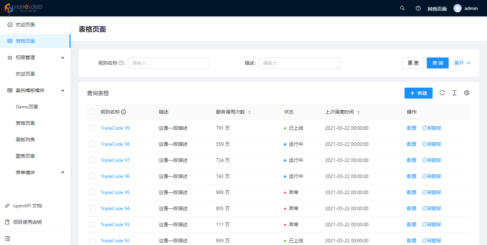
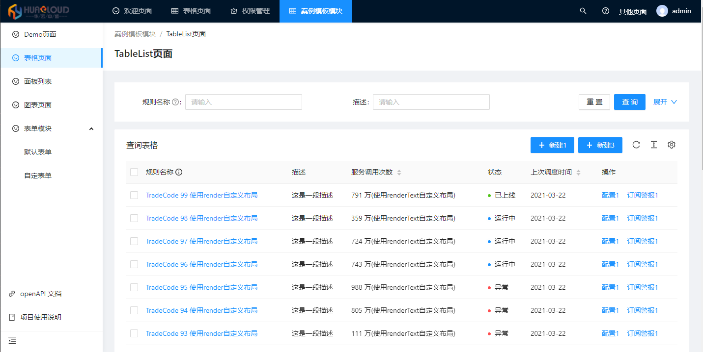
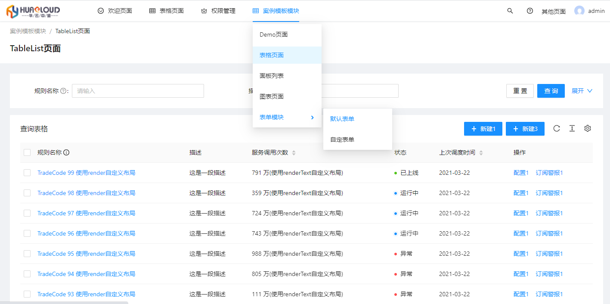
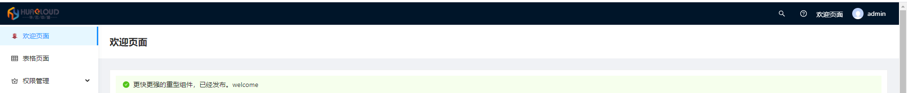
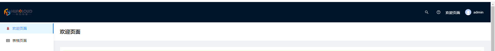

# 首页布局配置

首页布局的配置涉及到`config/config.ts`、`config/defaultSettings.ts` 和 `src/app.tsx` 这三个文件

# 1.默认的首页配置



### 首页`编译`时期的配置（这里的配置不能操作跟浏览器相关的 API，只能使用 Node 相关的 API）

```ts
// config.ts
export default defineConfig({
  layout: {
    // https://umijs.org/zh-CN/plugins/plugin-layout
    locale: true,
    siderWidth: 208,
    ...defaultSettings,
  },
});
```

> `layout` 更多的配置请查阅：[ProLayout - 高级布局](https://procomponents.ant.design/components/layout)

```ts
// config/defaultSettings.ts
import { Settings as LayoutSettings } from '@ant-design/pro-layout';

const Settings: LayoutSettings & {
  pwa?: boolean;
  logo?: string;
} = {
  navTheme: 'light',
  // 拂晓蓝
  primaryColor: '#1890ff',
  layout: 'mix',
  contentWidth: 'Fluid',
  fixedHeader: false,
  fixSiderbar: true,
  colorWeak: false,
  title: 'Ant Design Pro',
  pwa: false,
  logo: 'https://gw.alipayobjects.com/zos/rmsportal/KDpgvguMpGfqaHPjicRK.svg',
  iconfontUrl: '', // 菜单icon的自定义图标（ 一般可以直接引入 iconfont.js ）
};
export default Settings;
```

> `defaultSettings` 配置的是`ProLayout`组件的属性。更多的配置请查阅：[ProLayout - 高级布局](https://procomponents.ant.design/components/layout)

### 首页`运行`时期的配置（这里的配置能操作跟浏览器相关的 API，不能使用 Node 相关的 API）

```ts
// src/app.tsx
export const layout: RunTimeLayoutConfig = ({ initialState }) => {
  return {
    rightContentRender: () => <RightContent />,
    disableContentMargin: false,
    footerRender: () => <Footer />,
    onPageChange: () => {
      // todo ... 可以监听拦截某个路径，实现路劲的转发

      const { location } = history;
      // 如果没有登录，重定向到 login
      if (!initialState?.fetchUserInfo?.username && location.pathname !== '/user/login') {
        history.push('/user/login');
      }
    },
    links: isDev
      ? [
          <>
            <LinkOutlined />
            <span
              onClick={() => {
                window.open('/umi/plugin/openapi');
              }}
            >
              openAPI 文档
            </span>
          </>,
          <>
            <BookOutlined />
            <span
              onClick={() => {
                window.open('/~docs');
              }}
            >
              项目使用说明
            </span>
          </>,
        ]
      : [],
    menuHeaderRender: undefined,
    // 自定义 403 页面
    // unAccessible: <div>unAccessible</div>,
    ...initialState?.settings,
  };
};
```

> `layout` 更多的配置请查阅：[ProLayout - 高级布局](https://procomponents.ant.design/components/layout)

# 2.切割一级菜单至顶部



修改 `config/defaultSettings.ts` 文件的下面几个属性

```ts
//  config/defaultSettings.ts
import { Settings as LayoutSettings } from '@ant-design/pro-layout';

const Settings: LayoutSettings & {
  pwa?: boolean;
  logo?: string;
} = {
  ....
  ....
  ....

  layout: 'mix',
  fixedHeader: true,
  fixSiderbar: true,
  splitMenus: true,
  title: 'Ant Design Pro',
  logo: 'https://gw.alipayobjects.com/zos/rmsportal/KDpgvguMpGfqaHPjicRK.svg',

  ....
  ....
  ....
};


export default Settings;
```

> logo 这里的 logo 只可以接受 url，如果要接受组件需要在 `app.tsx` 的 layout 中配置。logo 宽过大会自动撑开布局

切割一级路由 可能需要做一下额外处理，例如

> 监听拦截某个路径，实现路劲的转发 。logo 可以接受一个组件

```ts
// src/app.tsx
export const layout: RunTimeLayoutConfig = ({ initialState }) => {
  return {
    ....
    ....
    ....
    onPageChange: () => {
      const { location } = history;

      // todo ... 可以监听拦截某个路径，实现路劲的转发
      // if(location.pathname === '/example'){
      //   history.push('/example/table-list');
      // }

      // 如果没有登录，重定向到 login
      if (!initialState?.fetchUserInfo?.username && location.pathname !== '/user/login') {
        history.push('/user/login');
      }
    },
    logo:() => <LogoImg/>
    ....
    ....
    ....
  };
};
```

# 3.菜单全部至顶部



修改 `config/defaultSettings.ts` 文件的下面几个属性

> 菜单全部至顶部 就不会有 左测菜单了

```ts
//  config/defaultSettings.ts
import { Settings as LayoutSettings } from '@ant-design/pro-layout';

const Settings: LayoutSettings & {
  pwa?: boolean;
  logo?: string;
} = {
  ....
  ....
  ....

  layout: 'top',
  fixedHeader: true,
  fixSiderbar: true,
  splitMenus: false,

  ....
  ....
  ....
};

export default Settings;
```

# 4.修改头部的样式

修改前 

添加 `styles/header.less` 文件, 修改默认高度

```less
@headerHeight: 80px; /* 自定义头部高度 */
.umi-plugin-layout-main {
  > .ant-layout {
    &.ant-layout-has-sider {
      .ant-layout-sider {
        padding-top: @headerHeight !important;
      }
    }
    > .ant-layout {
      > .ant-layout-header {
        height: @headerHeight !important;
        line-height: @headerHeight !important;
      }
    }
  }
}
```

在全局样式`global.less`文件中引入: `import '~@/styles/header.less';`

修改后 

# 4.自定义头部布局

# 4.自定义布局

> // todo ....
