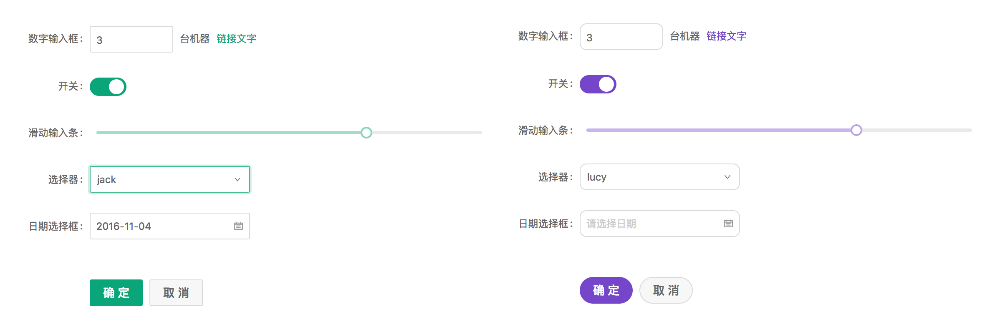
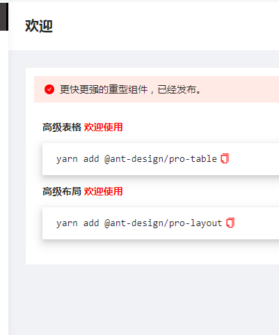

# 主题配置

**主题配置可以满足业务多样化的视觉需求**

> Pro 框架是基于 Ant Design 的进一步封装，主题配置依然可以延续`Ant Design`的配置，下图来自`Ant Design`官方文档。



## 样式变量

- antd 使用`less`作为开发语言,定义了一系列全局/组件的样式变量，以下是一些常用的变量，所有的样式变量见[这里](https://github.com/ant-design/ant-design/blob/master/components/style/themes/default.less)

```bash
  @primary-color: #1890ff; // 全局主色
  @link-color: #1890ff; // 链接色
  @success-color: #52c41a; // 成功色
  @warning-color: #faad14; // 警告色
  @error-color: #f5222d; // 错误色
  @font-size-base: 14px; // 主字号
  @heading-color: rgba(0, 0, 0, 0.85); // 标题色
  @text-color: rgba(0, 0, 0, 0.65); // 主文本色
  @text-color-secondary: rgba(0, 0, 0, 0.45); // 次文本色
  @disabled-color: rgba(0, 0, 0, 0.25); // 失效色
  @border-radius-base: 2px; // 组件/浮层圆角
  @border-color-base: #d9d9d9; // 边框色
  @box-shadow-base: 0 3px 6px -4px rgba(0, 0, 0, 0.12), 0 6px 16px 0 rgba(0, 0, 0, 0.08),
    0 9px 28px 8px rgba(0, 0, 0, 0.05); // 浮层阴影
```

## 定制方式

### 在 Umi 里面配置主题

在 Pro 项目根目录的`.umirc.ts`或者`congin/config.ts`文件中[theme](https://umijs.org/zh-CN/config#theme)字段进行主题配置。`theme`的类型为一个对象或者文件路径

具体配置如下：

```bash
"theme": {
    'primary-color': 'black' || defaultSettings.primaryColor,
    'link-color': 'red',
    'success-color': 'red',
    'border-color-base': 'blue',

    ....

    // 更多样式变量
}
```

展示效果如下

<!-- 
 -->




<!--  -->

或者[一个 js 文件](https://github.com/ant-design/ant-design-pro/blob/b7e7983661eb5e53dc807452e9653e93e74276d4/.webpackrc.js#L18)

```bash
"theme": "./theme.js",
```

**Umi3 默认提供暗黑和紧凑 2 种主题**

```bash
// .umirc.ts or config/config.ts
export default {
  antd: {
    dark: true, // 开启暗色主题 Antd 4.0.0+ 支持
    compact: true, // 开启紧凑主题  Antd 4.1.0+ 支持
  }
}
```

### Antd 还提供其他的方式定制主题

- 在 webpack 中定制主题
- 在 create-react-app 中定制主题
- 自定义 less 变量文件覆盖
- [更多配置信息请移步官方文档](https://ant.design/docs/react/customize-theme-cn)
