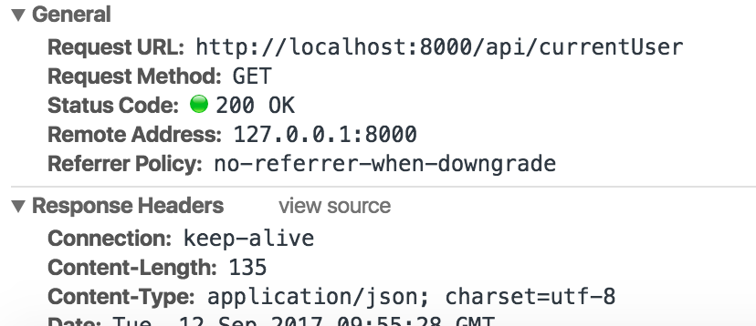
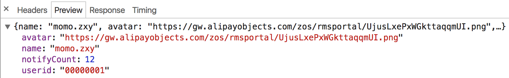
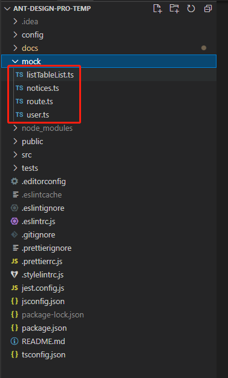

# 启用 mock

Mock 数据是前端开发过程中必不可少的一环，是分离前后端开发的关键链路。通过预先跟服务器端约定好的接口，模拟请求数据甚至逻辑，能够让前端开发独立自主，不会被服务端的开发所阻塞。

在 Ant Design Pro 中，因为我们的底层框架是 umi，而它自带了代理请求功能，通过代理请求就能够轻松处理数据模拟的功能。

# mock 的编写规范

规范包含：

### 1.文件夹 和 文件 命名规范

umi 里约定 `mock` 文件夹下的文件,文件以驼峰命名法，比如`listTable`、`seach`、`baseLayout`

### 2.代码编写规范

```ts
import { Request, Response } from 'express';
export default {
  // 支持值为 Object 和 Array
  'GET /api/users': { users: [1, 2] },

  // GET POST 可省略
  '/api/users/1': { id: 1 },

  // 支持自定义函数，API 参考 express@4
  'POST /api/users/create': (Request, Response) => {
    res.end('OK');
  },
};
```

# mock 的使用案例

当客户端（浏览器）发送请求，如：GET /api/users，那么本地启动的 umi dev 会跟此配置文件匹配请求路径以及方法，如果匹配到了，就会将请求通过配置处理，就可以像样例一样，你可以直接返回数据，也可以通过函数处理以及重定向到另一个服务器。

比如定义如下映射规则：

```ts
export default {
  'GET /api/currentUser': {
    name: 'momo.zxy',
    avatar: imgMap.user,
    userid: '00000001',
    notifyCount: 12,
  },
};
```

访问的本地 /api/currentUser 接口：</br>



返回的数据</br>



添加跨域请求头

```ts
'POST /api/users/create': (req, res) => {
  ...
  res.setHeader('Access-Control-Allow-Origin', '*');
  ...
},
```

合理的拆分你的 mock 文件



如何模拟延迟

```ts
'POST /api/forms': (req, res) => {
  setTimeout(() => {
    res.send('Ok');
  }, 1000);
},
```

使用插件模拟延迟

```ts
import { delay } from 'roadhog-api-doc';

const proxy = {
  'GET /api/project/notice': getNotice,
  'GET /api/activities': getActivities,
  'GET /api/rule': getRule,
  'GET /api/tags': mockjs.mock({
    'list|100': [{ name: '@city', 'value|1-100': 50, 'type|0-2': 1 }],
  }),
  'GET /api/fake_list': getFakeList,
  'GET /api/fake_chart_data': getFakeChartData,
  'GET /api/profile/basic': getProfileBasicData,
  'GET /api/profile/advanced': getProfileAdvancedData,
  'POST /api/register': (req, res) => {
    res.send({ status: 'ok' });
  },
  'GET /api/notices': getNotices,
};

// 调用 delay 函数，统一处理
export default delay(proxy, 1000);
```

# 停用 mock

当本地开发完毕之后，如果服务器的接口满足之前的约定，那么只需要关闭 mock 数据。

```ts
$ npm run start:no-mock // 不走 mock 数据
```

或者代理到服务端的真实接口地址即可。

```ts
$ npm start
```

开启 proxy 反向代理到服务器 url:https://umijs.org/zh-CN/config#proxy

```ts
// config/config.ts
export default {
  proxy: {
    '/api': {
      target: 'http://jsonplaceholder.typicode.com/',
      changeOrigin: true,
      pathRewrite: { '^/api': '' },
    },
  },
};
```
