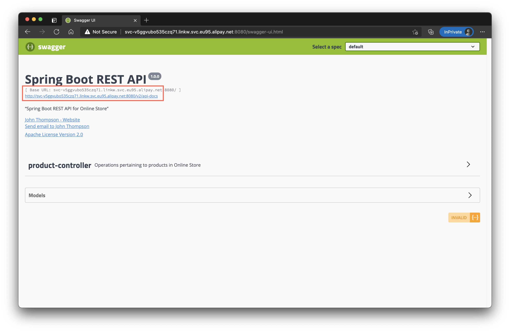
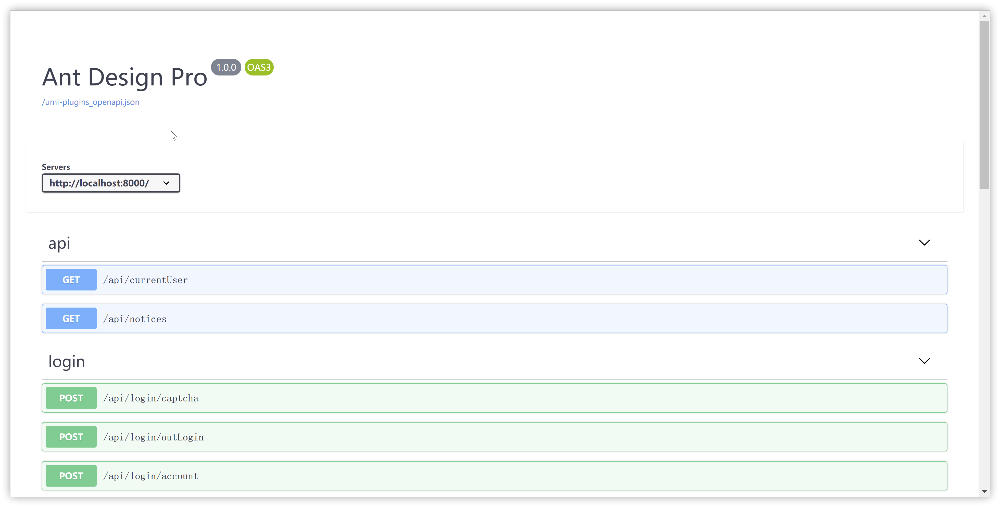

## 1、openApi 的集成

在 Pro 中引入 openAPI 的插件，在脚手架中自带了这个功能，如果使用的是非正式版本的 v5，可以通过下面的命令来安装这个插件。

```bash
 yarn add @umijs/plugin-openapi

 // npm
 npm i @umijs/plugin-openapi --save
```

然后在 config/config.ts 中配置 openAPI 的相关配置。

```ts
openAPI: {
    requestLibPath: "import { request } from 'umi'",
    // 或者使用在线的版本
    // schemaPath: "https://gw.alipayobjects.com/os/antfincdn/M%24jrzTTYJN/oneapi.json"
    schemaPath: join(__dirname, 'oneapi.json'),
    mock: false,
  }
```

还需要在 package.json 的 scripts 中增加一个命令。

```json
"openapi": "umi openapi",
```

最后就可以执行 npm run openapi 来生成相关的接口和文档。

## 2、openApi 的使用

openAPI 对于后端是有一些工作量的，但是工作量远远小于维护一个文档的成本，如果维护一个文档，那么每次更新完代码就需要重新编辑一遍文档。而使用 openAPI 的方式只要接入 swagger 然后做一些配置就可以生成一个界面，如果使用的是 python 或者是 java，那么接入会变得异常简单。详细的接入步骤可以看 [swagger](https://swagger.io/) 的官方文档。这里主要介绍前端如何使用。

后端接入完成 swagger 之后，就可以访问 swagger 生成的文档，一般来说都是 http://localhost:8080/swagger-ui.html，访问页面可以拿到一个 openapi 的规范文件。



复制 swagger 的 url 到 openapi 的配置中,以 pro 的 openapi 为例，配置如下：

```ts
openAPI: {
    requestLibPath: "import { request } from 'umi'",
    // 这里使用 copy 的 url
    schemaPath: "https://gw.alipayobjects.com/os/antfincdn/M%24jrzTTYJN/oneapi.json"
    mock: false,
  }
```

这里有两个配置 `requestLibPath` 和 `mock` 需要注意一下。

#### requestLibPath

requestLibPath 可以如何使用 request, 一般而言推荐直接使用 umi 的 request，但是有些时候需要自定义，可以修改 requestLibPath 的配置，比如要使用 utils 的中的 request，可以这么配置:

```ts
openAPI: {
    requestLibPath: "import request from '@utils/request",
    // 这里使用 copy 的 url
    schemaPath: "https://gw.alipayobjects.com/os/antfincdn/M%24jrzTTYJN/oneapi.json"
    mock: false,
  }
```

当然需要保证 schemaPath 配置引入 request，不然生成的代码可能无法执行。生成的代码如下：

```ts
// requestLibPath 的配置
import { request } from 'umi';

/** 获取规则列表 GET /api/rule */
export async function rule(params: API.PageParams, options?: { [key: string]: any }) {
  return request<API.RuleList>('/api/rule', {
    method: 'GET',
    params: {
      ...params,
    },
    ...(options || {}),
  });
}
```

注释也会自动载入，省去了我们查文档的麻烦，同时在 serves 中我们也会生成 typings.d.ts 文件，里面有 openapi 中包含所有定义。API.RuleList 就是后端需要返回的数据的描述，例子如下:

```ts
declare namespace API {
  type RuleListItem = {
    key?: number;
    disabled?: boolean;
    href?: string;
    avatar?: string;
    name?: string;
    owner?: string;
    desc?: string;
    callNo?: number;
    status?: number;
    updatedAt?: string;
    createdAt?: string;
    progress?: number;
  };

  type RuleList = {
    data?: RuleListItem[];
    /** 列表的内容总数 */
    total?: number;
    success?: boolean;
  };
}
```

这样就可以配合 ProTable，快速搞个 CURD，代码非常简单。

```ts
import { rule } from '@/services/ant-design-pro/rule';

// 两个泛型，第一个是列表项的类型定义，第二个是查询参数的定义。
// 一个表格已经生成了
<ProTable<API.RuleListItem, API.PageParams> request={rule} columns={columns} />;
```

#### mock

mock 就比较简单了，配置为 true 之后会自动生成一些 mock 的文件，虽然质量不如人肉写的，但是在开发中使用已经没问题了。生成的 mock 文件在项目根路径下的 mock 文件中,生成的 mock 数据每次都不同，如果要调试可以随意修改，只有执行 npm run openapi 才会进行修改。

```ts
import { Request, Response } from 'express';

export default {
  'GET /api/rule': (req: Request, res: Response) => {
    res.status(200).send({
      data: [
        {
          key: 86,
          disabled: false,
          href: 'https://ant.design',
          avatar: 'https://gw.alipayobjects.com/zos/rmsportal/KDpgvguMpGfqaHPjicRK.svg',
          name: '罗秀兰',
          owner: 'Garcia',
          desc: '斯达种整消建难风可却再日等果明此。',
          callNo: 96,
          status: 89,
          updatedAt: 'PpVmJ50',
          createdAt: 'FbRG',
          progress: 100,
        },
      ],
      total: 98,
      success: false,
    });
  },
};
```

#### 文档

在开发中不能只看代码，也是需要的看文档。Pro 中也默认集成了一下 swagger-ui ，提供了一个界面可以读取当前项目中的 openapi 配置，可以在 Layout 右下角找到一个快捷操作:



这个操作只在开发环境有效。如果是低版本可以访问 /umi/plugin/openapi 来查看，最后的效果应该是这样的:


## 3、openApi 自动生成类型

因为在与后端对接口的时候，我们一开始并不知道后端会返回哪些字段和类型，所以调试接口的时候我们首先需要拿到后端提供的字段名和字段类型，然后自定义一个类型用来接收后端返回的数据，这样操作太麻烦了，所以使用 openApi 能够根据接口自动生成相关的接口和文档。

配置好 openApi 只需要执行 npm run openapi 就能自动生成相关的接口和文档

> 这里需要注意的是，生成的接口文档我们可以拿来参考，并不用使用到项目中去，因为项目中我们的接口文档都有自己的规范，这个需要我们自己手动来添加。

只有生成的类型文档是我们需要用到的。
